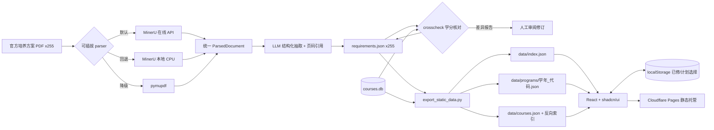

# 毕业要求查询与学分核查系统

面向学生的免登录工具型网站：浏览本专业毕业要求所涉全部课程，勾选「已修读 / 计划修读」，实时查看学分进度与缺口。数据底座由离线管线从官方培养方案 PDF 抽取生成，并与课程数据库交叉核对学分一致性。

> 毕业审核以教务处官方认定为准，本工具仅供参考。

已覆盖 **4 个学年 · 255 份培养方案**（主修 / 辅修 / Extended Major / 学院要求），全部可在线浏览。

## 架构



**核心设计**：LLM 只在离线管线中出现。管线产物在**构建前**被固化成静态 JSON，网站运行时直接 `fetch`——响应毫秒级、零 LLM 成本、零后端、结果稳定可测试。

## 技术栈

| 层 | 技术 |
|----|------|
| 前端 | React 18 + TypeScript + Vite 5 + Tailwind CSS + shadcn/ui + TanStack Query |
| 状态 | zustand + persist（localStorage） |
| 数据 | 静态 JSON（`scripts/export_static_data.py` 从 `pipeline/output/` + `courses.db` 生成） |
| 管线 | MinerU API（默认）/ MinerU 本地 / pymupdf + OpenAI 兼容 LLM + Pydantic Schema |
| 部署 | Cloudflare Pages（Git 集成，push 即上线，免费档） |
| 测试 | pytest（后端 8 例 · 管线）· vitest（前端 76 例）· GitHub Actions CI |

> `backend/`（FastAPI + SQLite）与 `Dockerfile` 保留为本地/容器备选，不再是前端数据源。

## 快速开始（前端，无需后端）

数据产物已随仓库提交，克隆即可跑：

```powershell
cd frontend
npm install
npm run dev    # http://localhost:5173
```

数据文件在 `frontend/public/data/`，本地 dev 与线上读的是同一份。

## 数据管线（生成培养方案数据）

### 环境变量

| 变量 | 说明 |
|------|------|
| `MINERU_API_TOKEN` | MinerU 官方 API Token（https://mineru.net 获取），批量解析必需 |
| `GRAD_LLM_API_KEY` | LLM API Key，结构化抽取必需 |
| `GRAD_LLM_BASE_URL` | 默认 `https://api.openai.com/v1`，兼容任意 OpenAI 风格接口 |
| `GRAD_LLM_MODEL` | 默认 `gpt-4o-mini` |

### 使用流程

```powershell
$env:PYTHONIOENCODING='utf-8'
cd pipeline

# 1. 单专业样本验证（先跑一个看效果）
.venv\Scripts\python.exe -m run_pipeline --year 2026-27 --code COMP

# 2. 快速验证 parser（不调 LLM，零成本）
.venv\Scripts\python.exe -m run_pipeline --year 2026-27 --code COMP --parser pymupdf --skip-llm

# 3. 批量处理全部 255 份 PDF（断点续跑：已有产物自动跳过，--force 覆盖）
.venv\Scripts\python.exe -m run_pipeline --all

# 4. 查看学分差异报告（pipeline/reports/crosscheck_*.md），人工校对 requirements_*.json

# 5. 校对完成后导出静态数据（写入 frontend/public/data，需随代码提交）
.venv\Scripts\python.exe scripts\export_static_data.py
```

产物说明：
- `pipeline/cache/` — PDF 解析缓存（同文件同后端只解析一次）
- `pipeline/output/requirements_*.json` — LLM 抽取结果（可 diff、可手工修订，导出脚本只认这个）
- `pipeline/reports/crosscheck_*.md` — 与 courses.db 的学分差异报告
- `frontend/public/data/` — 导出产物（入库）：`index.json` / `programs/*.json` / `courses.json` / `course_index.json`

## 公网部署（Cloudflare Pages，免费、无需信用卡）

全站纯静态：预生成的 JSON + 前端构建产物，Git 集成 push 即上线，无冷启动、无服务器、无需任何 Token/Secret。

### 一次性设置（约 5 分钟）

1. 注册 Cloudflare 账号（免费版无需信用卡）：https://dash.cloudflare.com/sign-up
2. Workers & Pages → Create → **Pages** → **Connect to Git**，选择本仓库
3. 构建配置：

   | 项 | 值 |
   |----|----|
   | Framework preset | `None`（或 Vite） |
   | Root directory | `frontend` |
   | Build command | `npm ci && npm run build` |
   | Build output directory | `dist` |

4. 保存并部署，完成后地址为 `https://<项目名>.pages.dev`；自定义域名可在 Pages 项目里免费绑定

### 数据与更新

- 数据更新流程：跑管线 → 校对 `pipeline/output/requirements_*.json` → 跑 `scripts/export_static_data.py` → 提交 → push 自动上线
- CI（`.github/workflows/ci.yml`）会跑 lint / 单测 / 构建，并断言 `programs == 255`、`courses == 1144`、四学年齐全、产物与 `pipeline/output` 一致；忘记导出会在 PR 上直接报红

### 免费档额度（对个人工具绰绰有余）

- Pages：无限请求、每月 500 次构建、单文件上限 20MB（本仓库最大产物约 1MB）
- 无信用卡、无冷启动；`_headers` 已为 `/assets/*` 配置 immutable 长缓存

## 测试

```powershell
# 前端（单测 + 规范）
cd frontend
npm test
npm run lint

# 静态数据完整性断言
python scripts/export_static_data.py --check

# 后端 + 管线（保留的本地路线）
.venv\Scripts\python.exe -m pytest backend/tests pipeline/tests -q
```

## 目录结构

```
frontend/    React SPA：三页面（方案总览 / 课程选择 / 要求明细）
             public/data/ 静态数据（由导出脚本生成，入库）
pipeline/    离线管线（parsers 可插拔 / llm_extract / crosscheck / run_pipeline CLI）
scripts/     export_static_data.py —— 管线产物 + courses.db → 前端静态数据
backend/     FastAPI API（本地备选：uvicorn + SQLite，非前端数据源）
unpress_pdf/ 官方培养方案 PDF 与爬虫索引（已有数据，勿改）
courses.db   官方课程库 1144 门课（只读原始数据，勿改）
docs/        数据更新指南
```
