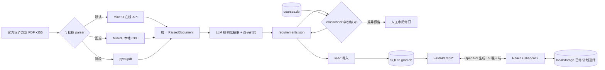

# 毕业要求查询与学分核查系统

面向学生的免登录工具型网站：浏览本专业毕业要求所涉全部课程，勾选「已修读 / 计划修读」，实时查看学分进度与缺口。数据底座由离线管线从官方培养方案 PDF 抽取生成，并与课程数据库交叉核对学分一致性。

> 毕业审核以教务处官方认定为准，本工具仅供参考。

## 架构



**核心设计**：LLM 只在离线管线中出现。网站运行时直接查结构化数据库——响应毫秒级、零 LLM 成本、结果稳定可测试。

## 技术栈

| 层 | 技术 |
|----|------|
| 后端 | Python 3.11 + FastAPI + SQLModel + SQLite |
| 前端 | React 18 + TypeScript + Vite 5 + Tailwind CSS + shadcn/ui + TanStack Query |
| 状态 | zustand + persist（localStorage） |
| 契约 | openapi-typescript + openapi-fetch（后端 OpenAPI 自动生成 TS 客户端） |
| 管线 | MinerU API（默认）/ MinerU 本地 / pymupdf + OpenAI 兼容 LLM + Pydantic Schema |
| 测试 | pytest（后端 8 例）· vitest（前端 10 例）· playwright-cli（E2E） |

## 快速开始

前置：`py` launcher（Python 3.11+）、Node 18+。

```powershell
# 1. Python 依赖（项目根 .venv，backend 与 pipeline 共用）
py -m venv .venv
.venv\Scripts\python.exe -m pip install fastapi "uvicorn[standard]" sqlmodel pydantic-settings pymupdf httpx openai pytest

# 2. 启动后端（自动把 courses.db 复制为可写副本 backend/data/grad.db）
.venv\Scripts\python.exe -m uvicorn app.main:app --port 8000 --app-dir backend

# 3. 启动前端（另开终端，Vite 已配置 /api 代理）
cd frontend
npm install
npm run dev    # http://localhost:5173
```

## 数据管线（生成培养方案数据库）

### 环境变量

| 变量 | 说明 |
|------|------|
| `MINERU_API_TOKEN` | MinerU 官方 API Token（https://mineru.net 获取），批量解析必需 |
| `GRAD_LLM_API_KEY` | LLM API Key，结构化抽取必需 |
| `GRAD_LLM_BASE_URL` | 默认 `https://api.openai.com/v1`，兼容任意 OpenAI 风格接口 |
| `GRAD_LLM_MODEL` | 默认 `gpt-4o-mini` |

### 使用流程

```powershell
cd pipeline
$env:PYTHONIOENCODING='utf-8'

# 1. 单专业样本验证（先跑一个看效果）
.venv\Scripts\python.exe -m run_pipeline --year 2026-27 --code COMP

# 2. 快速验证 parser（不调 LLM，零成本）
.venv\Scripts\python.exe -m run_pipeline --year 2026-27 --code COMP --parser pymupdf --skip-llm

# 3. 批量处理全部 255 份 PDF（断点续跑：已有产物自动跳过，--force 覆盖）
.venv\Scripts\python.exe -m run_pipeline --all

# 4. 查看学分差异报告（pipeline/reports/crosscheck_*.md），人工校对 requirements_*.json

# 5. 校对完成后导入数据库
.venv\Scripts\python.exe ..\backend\scripts\seed.py
```

产物说明：
- `pipeline/cache/` — PDF 解析缓存（同文件同后端只解析一次）
- `pipeline/output/requirements_*.json` — LLM 抽取结果（可 diff、可手工修订，seed 只认这个）
- `pipeline/reports/crosscheck_*.md` — 与 courses.db 的学分差异报告

## 公网部署（Koyeb 免费档）

单容器方案：FastAPI 同源托管前端静态产物 + SQLite（构建时烘焙进镜像），数据更新 = git push 重新部署，无需持久卷、无运行时 LLM 成本。

> 数据文件已入库（`courses.db` 与 `pipeline/output/`），平台从 git 构建 Docker 镜像时可直接使用。

### 部署步骤（Koyeb，无需信用卡）

1. 将本仓库 push 到 GitHub（private 仓库即可）
2. 打开 https://app.koyeb.com → 用 GitHub 账号登录
3. **Create Service**（或 Overview → Create Web Service）→ 选择 **GitHub** 仓库源 → 选中本仓库
4. 构建配置：
   - **Builder**：自动识别根目录 `Dockerfile`（无需额外配置）
   - **Port**：保持默认（容器内读取 `PORT` 环境变量；Koyeb 会自动注入）
   - **Health Check**：新增 HTTP 探针，Path 填 `/api/health`
   - **Instance**：Free（Nano）
   - 环境变量：无需任何配置（镜像内相对布局与仓库一致）
5. Deploy → 首次构建约 3–5 分钟，完成后获得 `https://<服务名>-<org>.koyeb.app`

此后每次 `git push` 自动触发重新构建部署。

### 免费档说明

- 免费 1 个实例（Nano：0.1 vCPU / 512MB），SQLite 毫秒级查询足够
- 实例长期常驻但资源可被平台抢占回收（回收后下次访问自动重启，约 30 秒冷启动）
- 注册用 GitHub 账号即可，正常使用不要求绑定信用卡（疑似滥用账号才可能被要求）

### 其他免费平台备选

- **Hugging Face Spaces**：最稳定，但免费档 Space 必须 Public（代码与数据公开），且需 GitHub Action 做自动同步
- **ClawCloud Run**：额度慷慨，但每天最多运行 12 小时

### 本地容器验证（可选，需 Docker）

```bash
docker build -t grad-app .
docker run --rm -p 8000:8000 grad-app   # http://localhost:8000
```

## 测试

```powershell
# 后端 + 管线（跑在临时数据库上，不污染真实数据）
.venv\Scripts\python.exe -m pytest backend/tests pipeline/tests -q

# 前端
cd frontend && npm test
```

## 目录结构

```
backend/     FastAPI API（复用 courses.db + 新增要求表，挂载可写副本 grad.db）
pipeline/    离线管线（parsers 可插拔 / llm_extract / crosscheck / run_pipeline CLI）
frontend/    React SPA（shadcn/ui 三页面：方案总览 / 课程选择 / 要求明细）
unpress_pdf/ 官方培养方案 PDF 与爬虫索引（已有数据，勿改）
courses.db   官方课程库 1144 门课（只读原始数据，勿改）
docs/        数据更新指南
```
