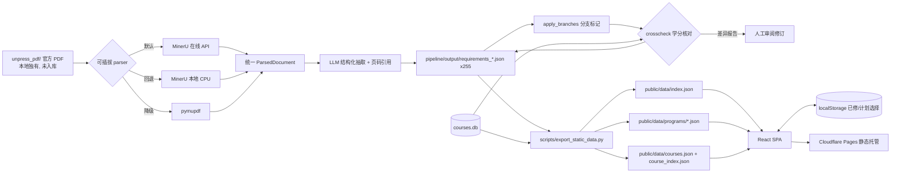

# 毕业要求查询与学分核查系统

面向学生的免登录工具型网站：浏览本专业毕业要求所涉全部课程，勾选「已修读 / 计划修读」，实时查看学分进度与缺口。数据底座由离线管线从官方培养方案 PDF 抽取生成，并与课程数据库交叉核对学分一致性。

> 毕业审核以教务处官方认定为准，本工具仅供参考。

已覆盖 **4 个学年 · 255 份培养方案**（主修 / 辅修 / Extended Major / 学院要求），全部可在线浏览。

## 架构总览



**核心设计**：LLM 只在离线管线中出现。管线产物在**构建前**被固化成静态 JSON，网站运行时直接 `fetch`——响应毫秒级、零 LLM 成本、零后端、结果稳定可测试。

**单数据源原则**：网站只认 `frontend/public/data/` 下的静态 JSON。任何数据变更都必须先改 `pipeline/output/` 再重跑导出脚本，不允许手改 `public/data/`（CI 会拦截不一致）。

## 技术栈

| 层 | 技术 |
|----|------|
| 前端 | React 18 + TypeScript + Vite 5 + Tailwind CSS + shadcn/ui + TanStack Query |
| 状态 | zustand + persist（localStorage） |
| 数据 | 静态 JSON（`scripts/export_static_data.py` 从 `pipeline/output/` + `courses.db` 生成） |
| 管线 | Python 3.12 + Pydantic Schema + 可插拔 parser（MinerU API / MinerU 本地 / pymupdf）+ OpenAI 兼容 LLM |
| 测试 | vitest（前端 112 例 / 9 文件）· pytest（管线 5 例 + 导出脚本 28 例）· `export_static_data.py --check`（数据断言） |
| CI / 部署 | GitHub Actions（lint / 单测 / 构建 / 数据一致性 / 管线与导出脚本单测）+ Cloudflare Pages（Git 集成） |

---

# 模块详解

## 1. 前端 SPA（`frontend/`）

**职责**：三视图（方案总览 / 课程选择 / 要求明细）的纯静态单页应用；负责渲染要求树、统计进度、记录用户勾选、解析成绩单 PDF。

**实现原理**

- **数据获取**：`lib/static-data.ts` 用 `import.meta.env.BASE_URL` 拼路径 fetch `public/data/*`。生产与本地 dev 读同一份文件，杜绝「本地能跑、线上缺数据」。
- **请求策略**：TanStack Query，`staleTime/gcTime = Infinity`（静态资源内容不可变）；首屏只请求 `index.json`（约 73 KB），方案树、课程库、反向索引均为按需懒加载。
- **进度核算**：`lib/audit.ts` 是纯函数，O(n) 单次遍历算出每组 `taken / planned / 缺口`，`planned` 建立在 `taken` 之上。
- **分支（Track / Option）**：`lib/branch.ts` 收集互斥分支，`filterGroupsByBranch` 过滤后交给核算函数，避免把整棵树的互斥课全部计入。
- **开放式层级池**：形如「MATH 2000-level or above」的组在导出时只存 `{subject, minLevel}`，运行时由 `lib/pools.ts` 用 `courses.json` 展开成真实课程清单，进度自动计入。
- **附加方案**：`lib/attached.ts` 识别辅修 / 学院要求 / Extended Major，`useAttachedTrees` 并行加载其要求树并合并统计。
- **组合规则（OR / AND）**：官方 Note 里的 `MATH 2421 OR MATH 2431`、捆绑 `(COMP 2011 AND COMP 2012) OR COMP 2012H`、以及 `[(MATH 1013 OR MATH 1023) AND (MATH 1014 OR MATH 1024)] OR [MATH 1020]` 这类规则，在数据里都是平铺课程。`lib/combos.ts` 把它们折叠为「有效课程」后再核算：
  - `part` = 一组「选一门」的备选（`/`），`option` = 若干 part 都要（`+`），OR 组合 = 若干互斥 option（`OR`），AND 组合 = 各 part 都要；
  - 已选课程优先，未选的 part 按组内学分最高预估；option **全部 part 已选才计满、部分完成计 0**（AND 意味着都要）；OR 组合取代表选项的优先级为 **已完成 > 部分完成 > 未选预估**，同级比学分；
  - `RequirementTree` 用 `comboCodes` 剔除已归入组合的平铺行，改由 `ComboRow` 合并成一行（各课程仍可单独勾选）。当前全站识别 **600 个组合组**，未识别清单已清零。
- **Common Core**：`lib/common-core.ts` 依据固化的 `src/data/common-core-course-map.json` 判定 30 学分通识分布（含学院 Home Area 规则）。
- **成绩单导入**：`lib/transcript.ts` 解析 pdfjs-dist（动态 `import()`，避免拖大首屏包）抽出的线性文本，识别学期 / 课号 / 学分 / 成绩，`**` 或缺失成绩记为「在读」；自动推导入学学年并回填主修、辅修、EXTM。
- **状态持久化**：三个 zustand store —— `profile`（主修/辅修/分支，`grad-profile-v1`，带 migrate）、`selection`（勾选状态）、`ui`（视图与弹窗）。全部 localStorage，免登录、无服务端。

**关键文件**

| 文件 | 作用 |
|------|------|
| `src/App.tsx` | 应用外壳：数据加载、错误/空态、视图路由（状态切换，非路由库） |
| `src/pages/OverviewPage.tsx` | 总览：进度总览条、各组进度、附加方案卡片 |
| `src/pages/CoursesPage.tsx` | 课程选择：搜索 + 状态筛选（全部/已修/计划/未选） |
| `src/pages/RequirementsPage.tsx` | 要求明细：要求树、官方 Note 引用、页码出处、存疑条目 |
| `src/hooks/queries.ts` | 全部数据查询 Hook（唯一数据出入口） |
| `src/lib/audit.ts` `branch.ts` `pools.ts` `attached.ts` `common-core.ts` `transcript.ts` `combos.ts` | 七块领域逻辑，均配套 `*.test.ts` |
| `src/components/business/ComboRow.tsx` | OR 组合行（二选一），与 `CourseRow` 视觉同构 |
| `src/types.ts` | 与静态 JSON 契约一致的 TypeScript 类型 |

**常用命令**

```powershell
cd frontend
npm install
npm run dev      # http://localhost:5173
npm test         # vitest 单测
npm run lint
npm run build    # tsc -b && vite build
npm run data:check   # 调用 ../scripts/export_static_data.py --check
```

## 2. 静态数据导出（`scripts/export_static_data.py`）

**职责**：把管线产物与课程库「烘焙」成前端可直接 fetch 的静态 JSON，是连接离线管线与在线站点的唯一桥梁。

**实现原理**

- 输入只读：`pipeline/output/requirements_*.json`（255 份人工校对后的产物）+ `courses.db`（只读 sqlite URI 打开）。
- 输出 `frontend/public/data/`：`index.json`（255 条方案元信息）、`programs/{year}_{code}.json`（单份完整要求树）、`courses.json`（1144 门课详情）、`course_index.json`（课程码 → 被哪些方案引用）、`meta.json`（生成时间与统计）。
- 全量重建：每次清空 `programs/` 重写，避免残留脏文件。
- 隐私与稳定：`source_pdf` 归一化为仓库相对路径（截取 `unpress_pdf/` 之后），防止本机绝对路径上公网；要求组 id 用组内序号 `order_index`，保证 React key 稳定。
- 反向索引单课程上限 50 条，超出截断但保留真实总数，防止通识类课程撑爆文件。
- **组合规则解析（后处理）**：`combo_rules.py` 用递归下降解析两套语法族，产出 `combos` 字段（`option.parts`：`part` 内选一门、part 之间为 AND）：
  - **关键字族**（官方 PDF 原文）：`expr := term (OR term)*`、`term := factor (AND factor)*`、`factor := 括号表达式 | 课号`；小写 `and` 视为英文散文（Electives 描述里的连接词）；
  - **符号族**（部分产物由抽取阶段写成）：`+` = 且、`/` = 或、`one of A / B / C` = 择一（绑定优先于 `+`）、相邻课号间的小写 `or` = 或；句首散文会被跳过（`Core required (lower-bound): EMIA 2010A (0) + ...`），表达式中间遇到英文单词即停止截断，课号后的括号学分 `(3)` / `(4-5)` 剥离不参与结构；
  - 斜杠链与小写 `or` 要求 token **真正相邻**（间隔只有空白），避免 `ECON 2103/2113/2123; FINA 2203/2303` 这种「被跳过的裸数字」把互不相干的链并成一个择一；
  - 组内缺失的课号从 `courses.db` 补齐，库里也没有的进 `unresolved`（前端只显示文本、不可勾选）。无法判定的句式**一律降级**，原文保留并在 `pipeline/reports/combos_unparsed.md` 出人工校对清单（CI 只 warning 不 fail）；符号族识别结果另出 `pipeline/reports/combos_parsed.md` 供抽查误判。这是与层级池 `pool`、分支 `branch` 同类的确定性后处理，不调用 LLM、不改 `pipeline/output/`。
- `--check` 只校验不写盘：断言 255 份方案 / 1144 门课 / 四学年齐全。

**关键文件**：`scripts/export_static_data.py`（主脚本）、`scripts/combo_rules.py`（OR 组合解析规则，纯函数）

**常用命令**

```powershell
python scripts/export_static_data.py            # 导出（产物需随代码提交）
python scripts/export_static_data.py --check    # 只校验
```

## 3. 离线数据管线（`pipeline/`）

**职责**：把 255 份官方培养方案 PDF 转成结构化「毕业要求规则库」，并与课程库交叉核对。

**实现原理**：五个阶段，全部可断点续跑（产物存在即跳过，`--force` 覆盖）。

1. **解析（可插拔）** —— `parsers/` 提供 `mineru_api`（默认，在线 API）/ `mineru_local`（本地 CPU 回退）/ `pymupdf`（降级）三个后端，统一产出 `ParsedDocument`。结果落盘 `cache/`，缓存键 = **学年 + 文件名 + 后端**（四个学年的 PDF 文件名完全相同，只按文件名缓存会学年串味）。
2. **LLM 结构化抽取** —— `llm_extract.py` 用「带页码标记的全文 + Pydantic Schema + JSON mode」，每个抽取项必须带 `source_pages`，可回溯 PDF 原文。输出经 `schemas.py` 校验；校验失败自动带「上次输出 + 错误详情」repair 重试，仍失败则切换下一个模型（`GRAD_LLM_MODELS` 逗号分隔模型池，429 时轮换）。
3. **分支标记** —— `apply_branches.py` 按 `branch_rules.py` 的正则/关键词规则给组打 `branch` 字段；**只增字段、幂等**（重复运行无 diff），识别不到的组保持原样，`branches_overrides.json` 提供人工兜底。
4. **学分交叉核对** —— `crosscheck.py` 把 LLM 抽取的学分与 `courses.db` 逐课对比（学分字符串容错解析，`4-6` 取下限），输出 JSON + Markdown 差异报告到 `reports/`，**只报告不自动改数据**。
5. **人工校对** —— 直接编辑 `pipeline/output/*.json`；这是流程的一部分，不是兜底。

**关键文件**

| 文件 | 作用 |
|------|------|
| `run_pipeline.py` | CLI 编排：读索引 → 解析（带缓存）→ 抽取 → crosscheck |
| `parsers/` | 三个解析后端 + 缓存键策略 |
| `llm_extract.py` | 抽取 prompt、Pydantic 校验、repair 重试、模型轮换 |
| `schemas.py` | 抽取契约（255 份产物的结构定义） |
| `crosscheck.py` | 学分一致性核对与差异报告 |
| `apply_branches.py` + `branch_rules.py` + `branches_overrides.json` | 分支标记与人工 override |

**常用命令**

```powershell
$env:PYTHONIOENCODING='utf-8'
cd pipeline

# 单专业样本验证
..\.venv\Scripts\python.exe -m run_pipeline --year 2026-27 --code COMP

# 只验证 parser（不调 LLM，零成本）
..\.venv\Scripts\python.exe -m run_pipeline --year 2026-27 --code COMP --parser pymupdf --skip-llm

# 批量（断点续跑，--force 覆盖）
..\.venv\Scripts\python.exe -m run_pipeline --all

# 只对现有产物重跑学分核对
..\.venv\Scripts\python.exe -m run_pipeline --crosscheck-only

# 分支标记（--dry-run 只算不写）
..\.venv\Scripts\python.exe apply_branches.py --dry-run
```

**环境变量**

| 变量 | 说明 |
|------|------|
| `MINERU_API_TOKEN` | MinerU 官方 API Token（https://mineru.net 获取），批量解析必需 |
| `GRAD_LLM_API_KEY` | LLM API Key，结构化抽取必需 |
| `GRAD_LLM_BASE_URL` | 默认 `https://api.openai.com/v1`，兼容任意 OpenAI 风格接口 |
| `GRAD_LLM_MODEL` | 默认 `gpt-4o-mini` |
| `GRAD_LLM_MODELS` | 逗号分隔模型池，429 时自动轮换（可选，显著提升批量吞吐） |

> 密钥一律用 shell 环境变量或 `.env`（已被 gitignore）注入，禁止写进仓库文件。

## 4. 课程库（`courses.db`）

**职责**：官方课程库 1144 门课，是学分核对的基准与前端课程详情的数据源。

**实现原理**：只读消费——`pipeline/crosscheck.py` 与 `scripts/export_static_data.py` 均以 `file:...?mode=ro` 只读 URI 打开，任何写入都会失败（设计如此）。`credits` 字段是 VARCHAR（`"3 Credit(s)"`、`"4-6 Credit(s)"`），统一容错解析为 float、范围取下限。更新课程库 = 替换 `courses.db` 后重跑 crosscheck 与导出脚本。

**关键文件**：`courses.db`（576 KB，随仓库提交）

## 5. PDF 源（`unpress_pdf/`）

**职责**：255 份官方培养方案 PDF 与爬虫索引 `major/index.json`（字段 `year / code / title / filename / pdf_url / status`，`status = downloaded` 才会被调度）。

**实现原理**：由外部爬虫维护，管线只读。**该目录已被 .gitignore 忽略（约 156 MB，本地独有）**——clone 仓库后没有 PDF 就无法跑管线，但已提交的 `pipeline/output/` 与 `frontend/public/data/` 足以让网站完整运行。

## 6. CI（`.github/workflows/ci.yml`）

**职责**：质量门禁。部署由 Cloudflare Pages 的 Git 集成负责，CI 只负责拦住坏提交。

**实现原理**：三个并行 job。

| job | 做什么 |
|-----|--------|
| `frontend` | Node 20 + `npm ci` → lint → vitest → build（均在 `frontend/` 下） |
| `pipeline` | Python 3.12 + 装管线依赖 → `pytest tests -q`（在 `pipeline/` 下）→ `pytest scripts/tests -q`（OR 组合解析规则） |
| `data` | `export_static_data.py --check`（255/1144/四学年断言）→ 重新导出后 `git diff --quiet` 断言 `frontend/public/data` 与 `pipeline/output` 一致；忘记导出会在 PR 上直接报红 |

## 7. 部署（Cloudflare Pages）

**职责**：全站纯静态托管，push 即上线，无服务器、无冷启动、无需任何 Token/Secret。

**实现原理**：预生成的 JSON + Vite 构建产物一起发布。

| 构建配置项 | 值 |
|-----------|-----|
| Framework preset | `None`（或 Vite） |
| Root directory | `frontend` |
| Build command | `npm ci && npm run build` |
| Build output directory | `dist` |

`frontend/public/_headers` 为 `/assets/*` 配置 immutable 长缓存。免费档额度：无限请求、每月 500 次构建、单文件上限 20 MB（本项目最大产物约 1 MB）。

---

# 快速开始（前端，无需后端）

数据产物已随仓库提交，克隆即可跑：

```powershell
cd frontend
npm install
npm run dev    # http://localhost:5173
```

# 数据更新 SOP

教务处发布新学年方案或修订现有 PDF 时：

1. **获取 PDF**：爬虫下载到 `unpress_pdf/major/<学年>/<CODE>_<Title>.pdf`，同步更新 `unpress_pdf/major/index.json`（`status: downloaded`）。
2. **单专业试跑**：`py -m run_pipeline --year <新学年> --code <CODE>`，先看效果再批量。
3. **看差异报告**：`pipeline/reports/crosscheck_<学年>_<代码>.md` —— `credits_mismatch` 表示抽取与课程库学分不一致，`missing_in_courses_db` 表示课程库缺这门课。
4. **人工校对产物**：重点核对每组 `required_credits` 是否与 PDF 原文一致（用 `source_pages` 翻原文）、`note` 组合规则是否完整、选修课的 `areas` 归属、`uncertain` 中 LLM 自述不确定的条目。直接编辑 JSON 即可，导出脚本只认 `output/`。

   | 产物版本 | note | areas | 前端表现 |
   |---------|------|-------|---------|
   | 旧 Schema | 有 | 无 | 显示官方说明，选修课平铺不分组 |
   | 新 Schema（2026-09 后） | 有 | 有 | 显示官方说明 + 选修课按 Area 分块 |

5. **批量 + 导出 + 提交**：
   ```powershell
   ..\.venv\Scripts\python.exe -m run_pipeline --all
   ..\.venv\Scripts\python.exe scripts\export_static_data.py
   ```
6. **本地验证**：`npm run dev` 确认新学年/专业出现在选择器中，要求明细能显示页码出处。

# 测试

```powershell
# 前端（112 例 / 9 文件）
cd frontend; npm test; npm run lint

# 管线 + 导出脚本（5 例 + 28 例）
cd pipeline; ..\.venv\Scripts\python.exe -m pytest tests -q
..\.venv\Scripts\python.exe -m pytest scripts/tests -q

# 静态数据完整性断言
python scripts/export_static_data.py --check
```

# 故障排查

| 现象 | 处理 |
|------|------|
| `缺少 MINERU_API_TOKEN` | 到 https://mineru.net 获取并设置环境变量；或先用 `--parser pymupdf --skip-llm` 验证链路 |
| 大量 `missing_in_courses_db` | 新学年课程代码未收录进 `courses.db`，先更新课程库再 `--crosscheck-only` 重跑 |
| `courses.db` 更新后网站数据没变 | 重跑 `scripts/export_static_data.py`（静态数据是一次性快照，不是运行时读库） |
| 批量中断 | 直接重跑同一命令，断点续跑会跳过已完成项 |
| CI 报「静态数据未同步」 | 本机跑一次导出脚本，把 `frontend/public/data` 的改动一起提交 |
| LLM 请求 403 地区限制 | OpenAI 官方端点对部分地区直接 403；换 OpenAI 兼容网关或国产模型，只改 `GRAD_LLM_BASE_URL` 即可 |
| LLM 长时间不返回 | GLM-4.5 等混合推理模型默认开启深度思考；请求体带 `{"thinking": {"type": "disabled"}}` 关掉（对不兼容服务无害） |
| 频繁 429 | 免费网关按模型独立限流；配置 `GRAD_LLM_MODELS` 模型池轮换 + 30 轮 ×10s 退避 |
| 真实请求 502 / 60s 超时 | HuggingFace 等免费上游有 60 秒硬超时；换更快的模型或降低单次输入页数 |
| MinerU 端点 404 | 文档滞后；真实流程是 `POST /file-urls/batch` → `PUT` 预签名 URL → `GET /extract-results/batch/{id}` 轮询，以官方 SDK 源码为准 |
| pymupdf 抽出乱序文本 | 官方 PDF 是文字版但表格无边框，`find_tables()` 检测不到；课程/学分类表格必须用 MinerU 等带版面分析的解析器 |
| LLM 输出合法 JSON 但缺字段 | 属正常现象，管线会自动 repair 重试并轮换模型；持续失败说明该模型不适合，从模型池中移除 |

**管线设计经验（TL;DR）**

1. LLM 输出必须过 Pydantic 校验，坏 JSON 自动修复重试
2. 探活必须用真实负载量级——小请求通过毫无意义（60s 超时与结构性 400 都藏在真实负载里）
3. 限流按模型独立计数 → 多模型轮换是免费资源下最强的吞吐杠杆
4. API 文档不可靠时读官方 SDK 源码
5. 解析结果落盘缓存（断点续跑 + 省钱省时）
6. 管线与在线服务彻底解耦：LLM 永不直接写库，产物 JSON 可 diff、可人工修订

# 目录结构

```
frontend/          React SPA：三页面（方案总览 / 课程选择 / 要求明细）
                   public/data/ 静态数据（由导出脚本生成，入库）
                   src/data/common-core-course-map.json 通识课程映射（已固化产物）
pipeline/          离线管线：parsers（可插拔解析）/ llm_extract / crosscheck
                   / apply_branches / run_pipeline CLI
                   output/   255 份 requirements_*.json（唯一事实来源，入库）
                   cache/    解析缓存（gitignore）
                   reports/  学分差异与分支审核报告（gitignore）
scripts/           export_static_data.py —— 管线产物 + courses.db → 前端静态数据
                   combo_rules.py —— 官方 Note 的 OR 组合确定性解析（纯函数）
                   tests/ —— 解析规则单测
courses.db         官方课程库 1144 门课（只读原始数据）
unpress_pdf/       官方培养方案 PDF 与爬虫索引（本地独有，已 gitignore）
.github/workflows/ CI：frontend / pipeline / data 三个门禁
```

# 已知约束

- **`unpress_pdf/` 未入库**（约 156 MB，已 gitignore）：clone 后无法重跑管线，但已提交的产物足以让网站完整运行。
- **`src/data/common-core-course-map.json` 是已固化产物**：由一次性脚本从本地 Common Core PDF 生成，原始输入未入库，生成脚本已移除；如需更新只能重新解析官方 PDF 后手工维护该文件。
- **课程库覆盖不完整**：crosscheck 会报部分 `missing_in_courses_db`（课程库只收录部分课程），这不等同于 LLM 抽取错误；该清单正好是课程库的补全清单。
- **LLM 产物必须人工校对**：管线只保证结构合法与学分可核对，规则语义（OR/AND 组合、互斥分支）依赖人工审阅。
- **组合解析的边界**：散文体（`... level 3 or above ... exempted`、`Courses from the specified list, of which at least 2 courses ...`）一律降级为官方说明原文，当前 `combos_unparsed.md` 已清零；但符号族（`+` `/` `one of` / 相邻小写 `or`）覆盖面更广、误判风险也更高，**26 条识别结果列在 `pipeline/reports/combos_parsed.md` 供抽查**（两份报告均需在本机跑一次导出生成，`pipeline/reports/` 未入库）。误判成组合会直接算错学分，比漏识别严重——新增句式请先补 `scripts/tests/test_combo_rules.py` 的用例再改规则。
- **符号族解析会在一行中部截断**：表达式中间遇到英文单词（如 `... + capstone EMIA 4990 (0) or EMIA 4991 (3) + ...` 里的 `capstone`）即停止，只取前半段（这是刻意的保守设计）。因此 EXTM 系的「核心要求」行目前只解析到第一个散文词为止，后续 `one of` 段仍按平铺展示。
- **总览页与附加要求卡的「门数」仍是平铺口径**：只有要求明细页改用有效门数（组合按 1 门计），`OverviewPage` / `AttachedAuditCard` 的门数暂按 `group.courses.length` 显示，后续可统一为 `effectiveCourseCount`。
